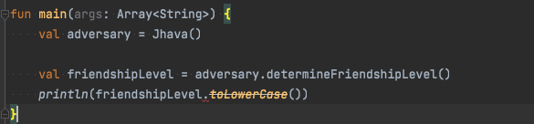

# 자바와의 상호운용

> 참고도서: 빅 너드 랜치의 코틀린 프로그래밍

코틀린 코드는 자바 바이트코드로 컴파일된다. 이것은 곧 코틀린이 자바와 상호운용 즉, 자바 코드와 같이 동작할 수 있다는 것을 뜻한다.
자바와의 상호운용은 코틀린 프로그래밍 언어의 가장 중요한 특성 중 하나.
자바와의 완벽한 상호운용은 자바에서 코틀린으로 서서히 이전할 수 있음을 뜻한다. 새로운 기능의 개발부터 코틀린을 사용하면서 점차적으로 비중을 높여 갈 수 있기
때문이다.

## 자바 클래스와 상호운용하기

```java
//Jahava.java
public class Jahava {
    public String utterGreeting() {
        return "BLARGH";
    }
}
```

```kotlin
//Hero.kt
fun main(args: Array<String>) {
    val adversary = Jahava()
    println(adversary.utterGreeting());
}
```

위 예제와 같이 코틀린은 자바와 유연하게 상호 운용되도록 개발되었으며, 자바에 비해 많은 기능이 향상되었다.

## 상호운용과 null 처리

```java
//Jahava.java
public class Jahava {
    public String utterGreeting() {
        return "BLARGH";
    }
    
    public String determineFriendshipLevel() {
        return null;
    }
}
```

```kotlin
//Hero.kt
fun main(args: Array<String>) {
    val adversary = Jahava()
    println(adversary.utterGreeting());

  val friendshipLevel = adversary.determineFriendshipLevel()
  println(friendshipLevel.toLowerCase())
}
```

위 함수 Hero.kt 를 실행해보면 컴파일 에러가 없었는데도 런타임 에러가 생기면서 프로그램 실행이 중단된다.
자바의 모든 객체는 언제든지 null이 될 수 있다. 그리고 determineFriendshipLevel과 같은 자바 메서드를 호출할 때 null이 반환될 수 있다는 것을 코틀린
컴파일러는 알 수 없다. 따라서 코틀린에서 자바 객체를 참조하는 변수를 사용할 때는 null에 안전한 처리를 해주어야 한다.

null 값이 될 수 있는 자바의 String 변수 또는 자바 메서드가 반환하는 String 값의 타입을 코틀린에서는 String! 나타낸다.
String!는 코틀린의 String 또는 String? 타입 모두가 될 수 있다는 것을 나타내며, 이것을 플랫폼 타입(platform type) 이라고 한다.

자바 코드에 null 관련 애노테이션을 지정하면 코틀린에서 사용할 때 null로 인한 문제가 생기지 않게 할수 있다. 
determineFriendshipLevel 메스드 헤더 앞에 @Nullable 애노테이션을 지정하면 null 값을 반환할 수 있다는 것을 컴파일러에게 알려 준다.

```java
//Jahava.java
public class Jahava {
    public String utterGreeting() {
        return "BLARGH";
    }
    
    @Nullable
    public String determineFriendshipLevel() {
        return null;
    }
}
```

@Nullable을 지정한후 Hero.kt 를 다시보면 toLowerCase 함수 호출 바로 앞의점(.)에 빨간색 밑줄로 경고를 보여줄 것이다.
toLowerCase 함수 호출 코드에 null 안전 호출 연산자인 ?를 추가하자.



Hero.kt를 다시 실행하면 컴파일 에러 없이 null이 출력될 것이다. friendshipLevel 이 nul 일 때는 무슨 의미인지 나타내는 기본값 제공을 하자.

```kotlin
//Hero.kt
fun main(args: Array<String>) {
    val adversary = Jahava()
    println(adversary.utterGreeting());

  val friendshipLevel = adversary.determineFriendshipLevel()
  println(friendshipLevel?.toLowerCase()?: "무슨 의미인지 난해하군요.")
}
```

자바 메서드가 null을 반환할 수 있다는 것을 알려 주기 위해 @Nullable을 사용하였다. 이와는 반대로 @NotNull 애노테이션을 사용하면 절대로 null 값을 
반환하지 않는다는 것을 알려 줄 수 있다.

Null 관련 애노테이션은 함수/메서드의 반환값, 매개변수, 필드에 사용될 수 있다. null로 인해 흔히 문제가 생기는 경우는 자바 코드와 상호 연동하는 
코틀린 코드를 작성할 때다. 따라서 코틀린에서 자바 코드를 사용할 때는 null이 되지 않는지 잘 살펴봐야 한다.

##타입 매핑

코틀린의 타입은 자바 타입과 일대일로 맵핑(mapping, 대응)된다. 예를 들어, 코틀린의 String 타입은 자바의 String 타입으로 컴파일된다.

그러나 코틀린과 자바 간에 일대일로 매핑되지 않는 타입들이 있다. 예를 들어, 자바의 기본 타입은 언어에 내장된 키워드를 사용해서 기본 데이터 타입을 나타낸다.
자바에서 기본 타입은 객체가 아니지만, 코틀린에서 기본 타입을 포함해서 모든 타입이 객체다. 그러므로 코틀린 컴파일러가 자바의 기본 타입을 가장 유사한 
코틀린 타입으로 맵핑 시켜준다.

```java
//Jahava.java
public class Jahava {
    public int hitPoints = 52489112;
    
    public String utterGreeting() {
        return "BLARGH";
    }
    
    @Nullable
    public String determineFriendshipLevel() {
        return null;
    }
}
```

```kotlin
//Hero.kt
fun main(args: Array<String>) {
    val adversary = Jahava()
    println(adversary.utterGreeting());

  val friendshipLevel = adversary.determineFriendshipLevel()
  println(friendshipLevel?.toLowerCase()?: "무슨 의미인지 난해하군요.")

  val adversaryHitPoints: Int = adversary.hitPoints
  println(adversaryHitPoints.dec())
  println(adversaryHitPoints.javaClass)
}
```

Hero.kt를 샐행하면 Jahava 클래스 인스턴스의 hitPoints 필드값에서 1을 뺀 52489111 이 정상적으로 출력될 것이다.
자바에서는 기본 타입에 대한 메서드를 호출할 수 없다. 그러나 코틀린에서는 adversaryHitPoints가 Int 타입의 객체이므로 Int 클래스의 값이나 변수에 대해
함수를 호출할 수 있다. adversaryHitPoints.javaClass는 정산적으로 int가 출력 될 것이다.
코틀린 코드에서는 adversaryHitPoints에 대해 Int 타입(클래스)의 함수를 호출할 수 있지만, 런타임 시에는 이 변수가 자바의 기본 타입인
int가 되기 때문이다. 이처럼 코틀린에서는 기본 타입도 객체를 사용하므로 객체지향의 장점을 십분 활용할 수 있으며, 런타임 시에는 성능 향상을 위해 상황에 따라 
자동으로 자바의 기본 타입으로 매핑시켜 준다.

## 게터와 세터 그리고 상호운용

코틀린과 자바는 클래스 속성을 매우 다르게 처리한다. 자바는 필드를 사용하며 게터(getter)라는 접근자(accessor) 메서드와 세터(setter)라는 변경자(mutator)
 메서드를 통해서 값을 읽거나 변경한다. 그러나 프로그래머의 선택에 따라 직접 필드를 사용할 수도 있다.
하지만 코틀린은 속성의 데이터를 갖는 후원 필드(backing field)의 접근을 제한하며, 자동 생성된 게터와 세터를 통해서만 외부에서 사용할수 있다.

hitPoints의 public 으로 선언은 캡슐화 원리에 어긋나므로 바람직하지 않다. 따라서 private로 변경하고 그 값을 읽을 수 있도록 게터 메서드를 생성하자.

```java
//Jahava.java
public class Jahava {
    private int hitPoints = 52489112;
    private String greeting = "BLARGH";

    @NotNull
    public String utterGreeting() {
        return greeting;
    }
    
    @Nullable
    public String determineFriendshipLevel() {
        return null;
    }

    public int getHitPoints() {
        return hitPoints;
    }

    public String getGreeting() {
        return greeting;
    }

    public void setGreeting(String greeting) {
        this.greeting = greeting;
    }
}
```

코틀린에서는 클래스의 캡슐화를 유지하면서도 직접 필드나 속성을 사용하는 것처럼 보이는 간결한 문법을 사용할 수 있다. 그러나 내부적으로는 반드시 게터와 세터를 
통해서 사용하게 되어 있다. 따라서 getHitPoints처럼 자바의 메서드 이름이 get으로 시작하면 코틀린에서는 get이 없는 변수 이름인 hitPoints로 이 메서드를
쉽게 참조할 수 있다. 코틀린 컴파일러가 이 자바 필드인 게터인 getHitPoints를 자동 호출 해 주기 때문이다.

```kotlin
//Hero.kt
fun main(args: Array<String>) {
    val adversary = Jahava()
    println(adversary.utterGreeting());

    val friendshipLevel = adversary.determineFriendshipLevel()
    println(friendshipLevel?.toLowerCase()?: "무슨 의미인지 난해하군요.")

    val adversaryHitPoints: Int = adversary.hitPoints
    println(adversaryHitPoints.dec())
    println(adversaryHitPoints.javaClass)

    adversary.greeting = "안녕하세요, 용사시여."
    println(adversary.utterGreeting())
}
```

## JVM 애노테이션

코틀린은 개발자가 작성하는 코드의 형식에 관해 더 큰 유연성을 제공한다. 코틀린에서는 파일 관점의 최상위 수준으로 클래스, 함수, 변수를 파일에 포함할 수 있다.
반면에 자바에서는 하나의 파일에 하나의 클래스만 포함된다. 그렇다면 코틀린 파일에 선언된 최상위 함수는 자바에서 어떻게 사용할 수 있는지 알아보자.

```kotlin
//Hero.kt
fun main(args: Array<String>) {
    val adversary = Jahava()
    println(adversary.utterGreeting());

    val friendshipLevel = adversary.determineFriendshipLevel()
    println(friendshipLevel?.toLowerCase()?: "무슨 의미인지 난해하군요.")

    val adversaryHitPoints: Int = adversary.hitPoints
    println(adversaryHitPoints.dec())
    println(adversaryHitPoints.javaClass)

    adversary.greeting = "안녕하세요, 용사시여."
    println(adversary.utterGreeting())
}

fun makeProclamation() = "안녕, 괴물아!"
```

```java
//Jahava.java
public class Jahava {
    private int hitPoints = 52489112;
    private String greeting = "BLARGH";

    @NotNull
    public String utterGreeting() {
        return greeting;
    }
    
    @Nullable
    public String determineFriendshipLevel() {
        return null;
    }

    public int getHitPoints() {
        return hitPoints;
    }

    public String getGreeting() {
        return greeting;
    }

    public void setGreeting(String greeting) {
        this.greeting = greeting;
    }

    public static void main(String[] args) {
        System.out.println(Hero.makeProclamation());
    }
}
```

코틀린에 정의된 최상위 수준 함수는 자바의 static 메서드가 되어 위와 같이 호출된다. 여기서 makeProclamation 함수는 Hero.kt에 정의되어 있다.
코틀린 컴파일러는 Hero.kt 파일을 컴파일하여 HeroKt라는 클래스(코틀린 파일 이름에 대문자 K와 소문자t를 붙인다)를 만들고 이 클래스의 static 메서드로
makeProclamation을 생성한다.

@JvmName 애노테이션을 사용하면 컴파일되어 생성되는 클래스 파일의 이름을 우리가 원하는 이름으로 변경할 수 있다. @JvmName 애노테이션을 Hero.kt 제일 위에
지정하자.

```kotlin
//Hero.kt
@file:JvmName("Hero")

fun main(args: Array<String>) {
    val adversary = Jahava()
    println(adversary.utterGreeting());

    val friendshipLevel = adversary.determineFriendshipLevel()
    println(friendshipLevel?.toLowerCase()?: "무슨 의미인지 난해하군요.")

    val adversaryHitPoints: Int = adversary.hitPoints
    println(adversaryHitPoints.dec())
    println(adversaryHitPoints.javaClass)

    adversary.greeting = "안녕하세요, 용사시여."
    println(adversary.utterGreeting())
}

fun makeProclamation() = "안녕, 괴물아!"
```

또 다른 중요한 JVM 애노테이션으로 @JvmOverloads가 있다. 코틀린에서 기본 매개변수(기본값을 갖는 매개변수)를 사용하면 매개변수를 달리하여
같은 함수를 여러 버전으로 오버로딩(overloading) 하지 않아도 된다. 실제로 어떻게 되는지 알아보기 위해 handOverFood라는 함수를 Hero.kt에 추가해 보자.

```kotlin
fun handOverFood(leftHand: String = "딸기", rightHand: String = "고기") {
 println("맛있는 $leftHand 와 $rightHand 를 넘겨주었습니다.")
}
```
우리의 용사가 handOverFood 함수에서 괴물에게 음식을 제공한다. 이 함수의 호출코드에서는 매개변수에 따라 호출 형태를 선택할 수 있다.
코틀린에서는 handOverFood 함수를 오버로딩하지 않고도 호출 코드에서 매개변수를 선택할 수 있게 해준다.

```java
public static void handOverFood(String leftHand, String rightHand) {
        println("맛있는 $leftHand 와 $rightHand 를 넘겨주었습니다.")
        }

public static void handOverFood(String leftHand) {
        handOverFood(leftHand, "고기")
        }

public static void handOverFood() {
        handOverFood("딸기", "고기")
        }
```

위와 같이 자바의 메서드 오버로딩은 코틀린의 기본 매개변수에 비해 훨씬 더 많은 코드 작성을 해야한다.
자바에서는 첫 번째 매개변수를 생략하여 기본값을 사용하게 하고 두번째 매개변수는 인자값을 전달하는 형태로 메서드를 호출 할수 없다.
그러나 코틀린에서는 지명 함수 인자(named function argument)를 사용하면 가능하다.

```java
//Jahava.java
public class Jahava {
    private int hitPoints = 52489112;
    private String greeting = "BLARGH";

    @NotNull
    public String utterGreeting() {
        return greeting;
    }
    
    @Nullable
    public String determineFriendshipLevel() {
        return null;
    }

    public int getHitPoints() {
        return hitPoints;
    }

    public String getGreeting() {
        return greeting;
    }

    public void setGreeting(String greeting) {
        this.greeting = greeting;
    }

    public static void main(String[] args) {
        System.out.println(Hero.makeProclamation());
    }
    
    public void offerFood() {
        Hero.handOverFood("피자");
    }
}
```
이와 같이 handOverFood를 호출하는 것은 컴파일 에러가 된다. 자바는 인자를 생략할 수 없기 떄문이다.
코틀린에서는 메서드 오버로딩을 하지 않고 인자를 선택해서 전달할 수 있는 방법을 제공한다. 자바에는 이런 기능이 없으므로 코틀린 함수를 컴파일하여 오버로딩된 
메서드를 생성해야만 자바에서 사용할 수 있다. 이떄 코틀린 함수에 @JvmOverloads 애노테이션을 추가하자.

```kotlin
@JvmOverloads
fun handOverFood(leftHand: String = "딸기", rightHand: String = "고기") {
 println("맛있는 $leftHand 와 $rightHand 를 넘겨주었습니다.")
}
```

자바에서 코틀린의 handOverFodd 함수를 호출할 때 이제는 하나의 인자만 전달할 수도 있다.

```kotlin
//Hero.kt
@file:JvmName("Hero")

fun main(args: Array<String>) {
    val adversary = Jahava()
    println(adversary.utterGreeting());

    val friendshipLevel = adversary.determineFriendshipLevel()
    println(friendshipLevel?.toLowerCase()?: "무슨 의미인지 난해하군요.")

    val adversaryHitPoints: Int = adversary.hitPoints
    println(adversaryHitPoints.dec())
    println(adversaryHitPoints.javaClass)

    adversary.greeting = "안녕하세요, 용사시여."
    println(adversary.utterGreeting())
 
    adversary.offerFood()
}

fun makeProclamation() = "안녕, 괴물아!"
```

자바 코드와 상호운용되는 코틀린 코드를 작성할 때 고려해야 할 JVM 애노테이션이 두 개 더 있다.

```kotlin
//Hero.kt
@file:JvmName("Hero")

class Spellbook {
 val spells = listOf("Magic Ms. L", "Lay on Hans")
}
```

코틀린과 자바는 클래스 속성을 다르게 처리한다. 그 결과로 자바에서는 우리가 게터와 세터를 정의하고 호출하여 필드를 사용하거나 또는 직접 필드를 사용한다.
그러나 코틀린에서는 반드시 자동 생성된 게터와 세터를 통해서만 속성을 사용할 수 있으며, 속설을 참조할 때 게터와 세터가 자동 호출되므로 코드가 간결하다.

코틀린에서 Spellbook의 spells 속성을 참조할 때는 다음과 같이 한다.

```kotlin
  val spellbook = Spellbook()
  val spells = spellbook.spells
```

자바의 경우는 다음과 같이 spells 속성을 참조한다.

```java
  Spellbook spellbook = new Spellbook();
  List<String> spells - spellbook.getSpells();
```

spells 필드를 직접 참조하지 않도록 하기 위해 자바에서는 게터인 getSpells를 호출해야 한다.
그러나 코틀린 속성에 @JvmField 애노테이션을 지정하면 게터 메서드를 호출하는 코드를 작성하지 않고 자바에서 코틀린 속성을 사용할 수 있다.

```kotlin
//Hero.kt
@file:JvmName("Hero")

class Spellbook {
 @JvmField
 val spells = listOf("Magic Ms. L", "Lay on Hans")
}
```

```java
  public static void main(String[] args) {
        System.out.println(Hero.makeProclamation());

        System.out.println("Spells:");
        Spellbook spellbook = new Spellbook();
        for (String spell : spellbook.spells) {
            System.out.println(spell);
        }
```

@JvmField는 동반 객체(companion object)의 값을 나타내기 위해 사용될 수도 있다. 동반 객체는 다른 클래스 정의 안에 선언된다.
그리고 동반 객체 자신을 포함하는 클래스가 초기화되거나, 또는 동반 객체의 속성이나 함수가 사용될 떄 초기화된다.
MAX_SPELL_COUNT 라는 변수를 포함하는 동반 객체를 Spellbook에 추가하자.

```kotlin
//Hero.kt
@file:JvmName("Hero")

class Spellbook {
 @JvmField
 val spells = listOf("Magic Ms. L", "Lay on Hans")

 companion object {
  val MAX_SPELL_COUNT = 10
 }
}
```

```java
  public static void main(String[] args) {
        System.out.println(Hero.makeProclamation());

        System.out.println("Spells:");
        Spellbook spellbook = new Spellbook();
        for (String spell : spellbook.spells) {
            System.out.println(spell);
        }
        System.out.println("Max spell count: " + Spellbook.MAX_SPELL_COUNT);
```

위 코드는 컴파일 에러가 된다. 자바에서 코틀린의 동반 객체를 참조할 떄는 동반객체를 나타내는 Companion 키워드와 게터를 나타내는 접두사인 get 키워드를 지정해야
하기 때문이다. 그러나 @JvmField 애노테이션을 사용하면 코틀린 컴파일러가 알아서 해주므로 그럴 필요 없다.
또 @JvmField 애노테이션이 추가되면 자바 코드에서 다른 자바 static 변수 처럼 MAX_SPELL_COUNT를 사용할 수 있기 때문이다.

```kotlin
//Hero.kt
@file:JvmName("Hero")

class Spellbook {
 @JvmField
 val spells = listOf("Magic Ms. L", "Lay on Hans")

 companion object {
  @JvmField
  val MAX_SPELL_COUNT = 10
 }
}
```

### 예외와 상호운용

```java
public class Jahava {
 private int hitPoints = 52489112;
 private String greeting = "BLARGH";

 public String utterGreeting() {
  return greeting;
 }

 public String determineFriendshipLevel() {
  return null;
 }

 public int getHitPoints() {
  return hitPoints;
 }

 public String getGreeting() {
  return greeting;
 }

 public void setGreeting(String greeting) {
  this.greeting = greeting;
 }

 public void offerFood() {
  Hero.handOverFood("피자");
 }

 public void extendHandInFriendship() throws Exception {
  throw new Exception();
 }

}
```

```kotlin
@file:JvmName("Hero")

fun main(args: Array<String>) {
 val adversary = Jahava()

 adversary.extendHandInFriendship()
}
```
Jahava 에 extendHandInFriendship 메서드를 추가하였다. Hero.kt의 main에서 extendHandInFriendship 호출 하면 런타임 예외가 발생될 것이다.
코틀린의 모든 예외는 unchecked다. 즉 예외가 생길 수 있는 모든 코드를 우리가 try/catch 블록으로 반드시 처리하도록 컴파일러가 강요하지 않는다.
따라서 코틀린에서 자바 메서드를 사용할 때는 예외를 발생시킬 수 있는지 확인해야 한다.

```kotlin
@file:JvmName("Hero")

fun main(args: Array<String>) {
 val adversary = Jahava()

 try {
  adversary.extendHandInFriendship()
 } catch (e: Exception) {
  println("잘가라, 못된 괴물아!")
 }
}

fun acceptApology() {
 throw IOException()
}
```

자바 코드에서 코틀린 함수를 호출하면서 예외를 처리할 때는 추가로 알아야 할 것이 있다. 

```kotlin
@file:JvmName("Hero")

fun main(args: Array<String>) {
 val adversary = Jahava()

 try {
  adversary.extendHandInFriendship()
 } catch (e: Exception) {
  println("잘가라, 못된 괴물아!")
 }
}

fun acceptApology() {
 throw IOException()
}
```

```java
public class Jahava {
 
 public void extendHandInFriendship() throws Exception {
  throw new Exception();
 }

 public void apologize() {
  try {
   Hero.acceptApology();
  } catch (IOException e) {
   System.out.println("Caught!");
  }
 }

}
```

acceptApology를 호출할 때 발생하는 예외를 try/catch 블록으로 처리하였다. 그러나 자바 컴파일러는 try 블록의 acceptApology 호출 코드에서
IOException 이 발생되지 않는다고 경고를 준다. 코틀린의 acceptApology 함수에서는 분명히 IOEception을 발생시키는데 그 이유는 
바이트코드를 자바로 역컴파일한 acceptApology 함수 코드를 보면 알수 있다.

```java
  public static final void acceptApology() {
    throw (Throwable)(new IOException());
  }
```
이 메서드를 호출하는 코드에서 반드시 처리해야 하는 checked 예외라는 것을 알려 주는 throws IOException이 메서드 이름 다음에 지정되어 있지 않다.
따라서 자바 컴파일러는 acceptApology가 IOException을 발생시키지 않는다고 판단한 것이다.

이런 경우에 @Throws 애노테이션이 문제를 해결해 준다. 이 애노테이션을 사용하면 코틀린 함수에서 발생시키는 예외에 관한 정보가 바이트코드에 포함된다.

```kotlin
@file:JvmName("Hero")

fun main(args: Array<String>) {
 val adversary = Jahava()

 try {
  adversary.extendHandInFriendship()
 } catch (e: Exception) {
  println("잘가라, 못된 괴물아!")
 }
}

@Throws(IOException::class)
fun acceptApology() {
 throw IOException()
}
```

추가한 다음 바이트코드를 자바로 역컴파일한 코드를 확인하면 다음과 같다.
```java
  public static final void acceptApology() throws IOException{
    throw (Throwable)(new IOException());
  }
```

@Throws 애노테이션을 지정했기 떄문에 acceptApology가 IOException을 발생시킬 수 있다고 알려 주었으므로 예외 처리가 되어야 한다는 것을 컴파일러가 알았기 때문이다.
개념적인 차이가 있는 자바와 코틀린 간의 예외 처리 문제를 매끄럽게 해소시켜 주는 것이 @Throws 애노테이션이다.

##자바의 함수 타입

코틀린의 함수 타입을 자바에서 호출할 떄 자바에서는 코틀린의 함수 타입이 Function과 같은 이름의 인터페이스로 구현된다.

```kotlin
@file:JvmName("Hero")

fun main(args: Array<String>) {
 val adversary = Jahava()

 try {
  adversary.extendHandInFriendship()
 } catch (e: Exception) {
  println("잘가라, 못된 괴물아!")
 }
}

val translator = { utterance: String ->
 println(utterance.toLowerCase().capitalize())
}

```
translator 의 타입은 (String) -> Unit이다. String타입의 인자를 받으며 결과를 반환하지 않는 익명 함수다.
자바에서는 이 함수 타입이 어떻게 처리되는지 Java에 추가해 보자

```java
import kotlin.Unit;
import kotlin.jvm.functions.Function1;

    public static void main(String[] args) {
        Function1<String, Unit> translatorJ = Hero.getTranslator();
    }
```

코틀린에 선언된 Translator 인스턴스 참조는 getTranslator를 호출 하여 얻는다.
translatorJ 변수의 타입은 function1<String,Unit>다. 코틀린으로 정의된 translator 인스턴스는 하나의 매개변수만 가지므로 translatorJ 변수의 
기본 타입은 Function1이 된다. 그리고 제네릭 타입 매개변수로 사용된 String은 인자의 타입을 나타내고, Unit는 반환 타입을 나타낸다.
Function 인터페이스는 Function0부터 Function22까지 23개가 있으면, 이것들 각각은 하나의 invoke 함수를 포함한다.
invoke는 함수 타입을 호출하기 위해 사용된다. 따라서 함수 타입을 호출할 때는 언제든지 invoke를 사용하면 된다.

```java
import kotlin.Unit;
import kotlin.jvm.functions.Function1;

    public static void main(String[] args) {
        Function1<String, Unit> translatorJ = Hero.getTranslator();
        translatorJ.invoke("TRUCE");
    }
```

