## 코루틴이란? 

코루틴은 쓰레드와 마찬가지로 동시성 프로그래밍을 위한 하나의 기법이다.  
코루틴은 쓰레드의 대체제가 아니라, Thread를 더 잘게 쪼개어 사용 가능한 개념이라고 이해하면 쉽다. 
 * 또한 각 코루틴은 수행 도중에 일을 잠시 미뤄두었다가 나중에 해당 지점부터 다시 처리할 수 있다. 

안드로이드 관련 코루틴 문서에서는 다음과 같이 정의하고 있다. 
 * 코루틴은 비동기적으로 실행되는 코드를 간소화하기 위해 사용할 수 있는 동시 실행 설계 패턴입니다.
   * 경량: 코루틴을 실행 중인 스레드를 차단하지 않는 정지를 지원하므로 단일 스레드에서 많은 코루틴을 실행할 수 있습니다. 정지는 많은 동시 작업을 지원하면서도 차단보다 메모리를 절약합니다. 
   * 기본으로 제공되는 취소 지원: 실행 중인 코루틴 계층 구조를 통해 자동으로 취소가 전달됩니다.
   * https://developer.android.com/kotlin/coroutines?hl=ko 

쓰레드의 동시성 처리와 코루틴 동시성 처리에 대한 비교 그림 
 * 참고자료: https://velog.io/@haero_kim/Thread-vs-Coroutine-%EB%B9%84%EA%B5%90%ED%95%B4%EB%B3%B4%EA%B8%B0 

**1) 쓰레드**

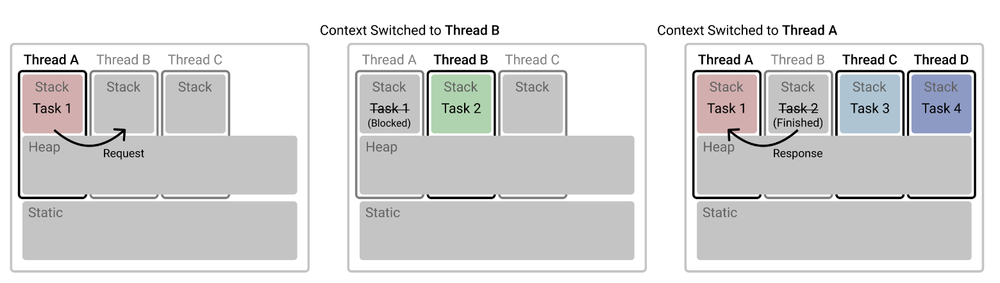
 * 쓰레드A에서 Task 1을 수행하다가 Task 2의 결과가 필요할때 비동기적으로 Thread B를 호출한 케이스이다. 
 * 이 경우 Thread A 는 블록되고, Thread B로 컨텍스트 스위칭이 일어나며 Task 2 가 수행된다. 

**2) 코루틴**

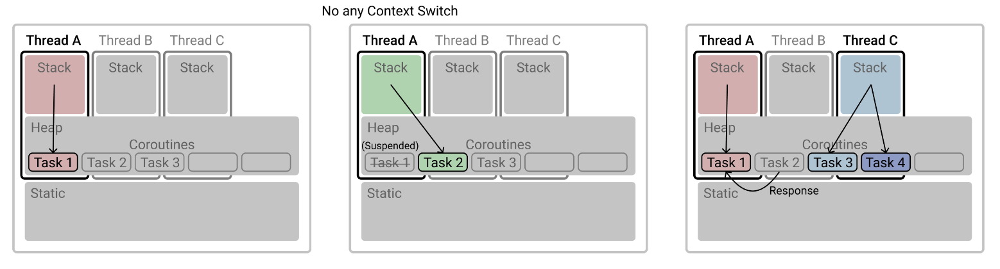
 * 동일한 상황에서 코루틴의 경우, 위 그림과 같이 기존에 작업하던 Task 1 을 suspended 해놓고 컨텍스트 스위칭 없이 Task 2 를 수행할 수 있다. 그림에서는 Thread A 가 Task 2를 마치고 다시 Task 1을 수행하고 있지만, 구현방법에 따라 다른 Thread가 suspended 된 Task의 나머지 로직을 수행할 수도 있다.  

### 일시 중단 가능 

코루틴은 기본적으로 일시 중단이 가능하다. 내부에서 해당 코루틴을 일시 중단해야하는 동작이 있으면 코루틴은 일시 중단된다. 코루틴은 실행 결과로 job 을 생성하기 때문에, 이 job 객체를 이용하여 일시 중단 시점을 지정할 수 있다. 
 * 참고 자료: https://kotlinworld.com/144 

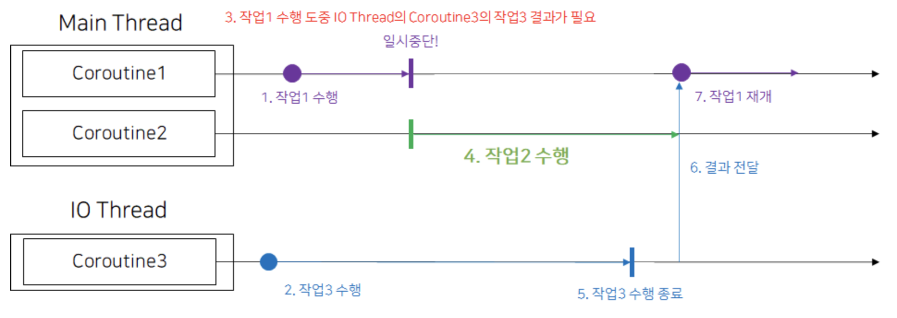
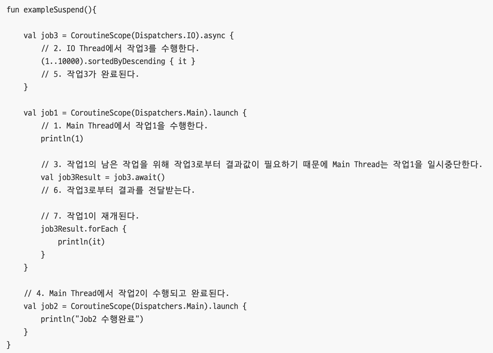 
 

### 콜백을 대체 

Suspend 함수를 이용하여 코루틴에서 동작하게끔 함으로써, 백그라운드에서 수행되도록 함과 동시에 콜백처럼 작성하지 않고도 콜백을 작성한것과 같은 효과를 누릴 수 있다. 

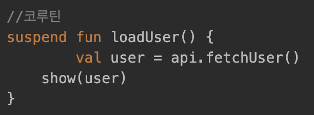 

## 개발을 위한 준비 
공식 standard library에 포함돼있지 않으므로 다음과 같이 org.jetbrains.kotlinx 패키지에 해당하는 코루틴 의존성을 추가해야한다. 
 * https://kotlin.github.io/kotlinx.coroutines/kotlinx-coroutines-core/index.html 
 * https://mvnrepository.com/artifact/org.jetbrains.kotlinx/kotlinx-coroutines-core 

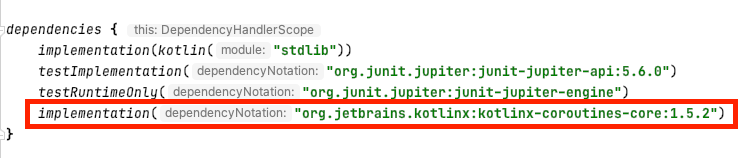
  

## 여러가지 코루틴 빌더 함수들 

Kotlinx-coroutines 에서 제공하는, 코루틴을 생성해주는 함수들을 의미한다. 
대표적으로 다음과 같은 것들이 있다. 
 * 참고 자료: https://kotlin.github.io/kotlinx.coroutines/kotlinx-coroutines-core/index.html 

#### launch 

코루틴을 실행하며 결과값을 제공하지는 않는다. (CompletableFuture.runAsync 느낌) 
job을 리턴하며, join() 함수를 이용하여 일시 중단을 수행할 수 있다.  

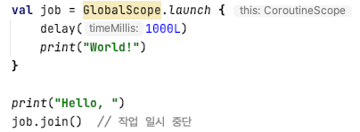

#### async 

코루틴을 실행하며 결과값을 제공한다. (CompletableFuture.supplyAsync 느낌) 
deferred를 리턴하며, await() 함수를 이용하여 일시 중단을 수행할 수 있다. 

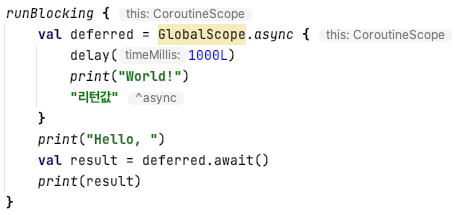

#### runBlocking 

내부의 코루틴 및 자식 코루틴이 모두 끝날때까지 해당 쓰레드를 블록시킨다. 
단, top-level 코루틴(GlobalScope)와 runBlocking 코루틴은 구조적으로 관계가 없기때문에 runBlocking 내에서 GlobalScope를 이용하면 코루틴이 끝나든 말든 상관없이 join이 없으면 쓰레드가 종료되므로 주의해야한다. 

#### delay 

Non-blocking sleep 을 실행하는 함수이다. Blocking sleep인 Thread.sleep 과 상반되는 개념 
구현체를 보면 예상한 대로 suspend 함수로 구현되어있으며, 이에 따라 coroutine의 suspended 로 처리될 수 있다. 

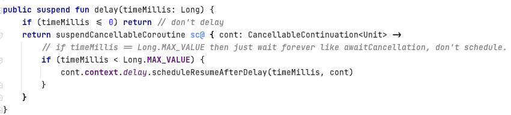

## Hello, World! 

코루틴을 사용하여 코드를 작성하는 방법은 다음과 같이 하면 된다. 
 * 참고자료: https://medium.com/@limgyumin/%EC%BD%94%ED%8B%80%EB%A6%B0-%EC%BD%94%EB%A3%A8%ED%8B%B4%EC%9D%98-%EA%B8%B0%EC%B4%88-cac60d4d621b 
  * 사용할 Dispatcher 를 결정하고 
  * Dispatcher 를 이용해서 CoroutineScope 만들고 
  * CoroutineScope 의 launch 또는 async 에 수행할 코드 블록을 넘기면 된다. 

**launch 예제**

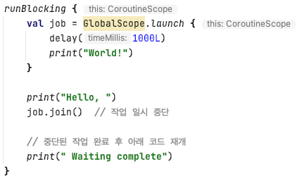

**결과)**

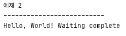

**async 예제**

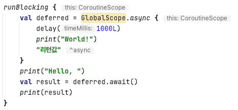

**결과)**

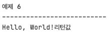 

**코루틴과 쓰레드의 관계 예제**

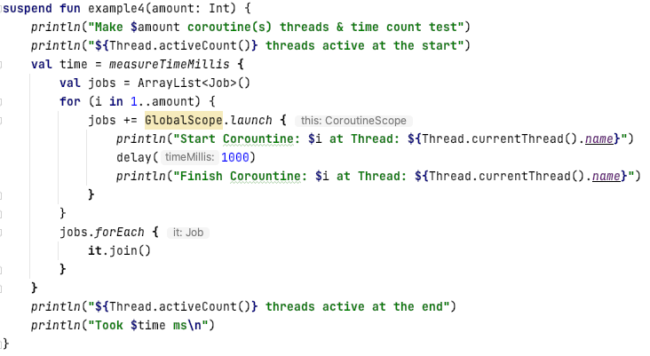

**결과)**
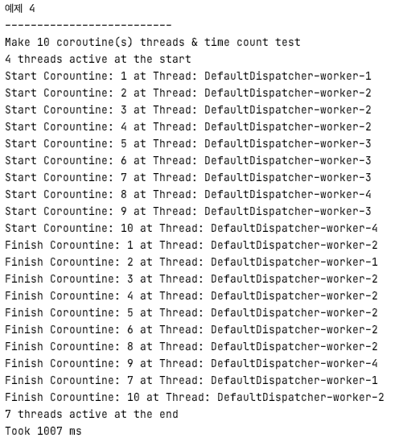

**ThreadPool 지정 예제**

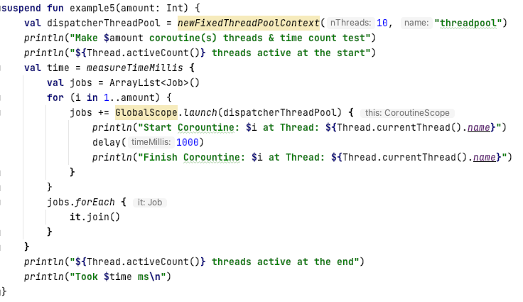

**결과)**

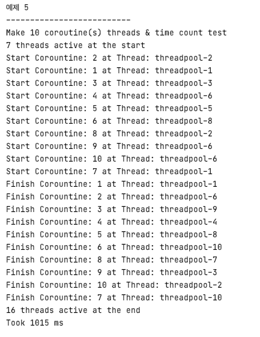

## 다음 코루틴 스터디 주제로 생각해볼만한 것들 
 * 코루틴의 스코프, GlobalScope vs CoroutineScope 
 * CoroutineContext 
 * suspend의 원리 
 * Dispatcher의 역할 
 * 코루틴 계층 구조와 실패 / 취소 전파 관계
 * 코루틴 실전 활용 (API call, DB RUD 등)  
