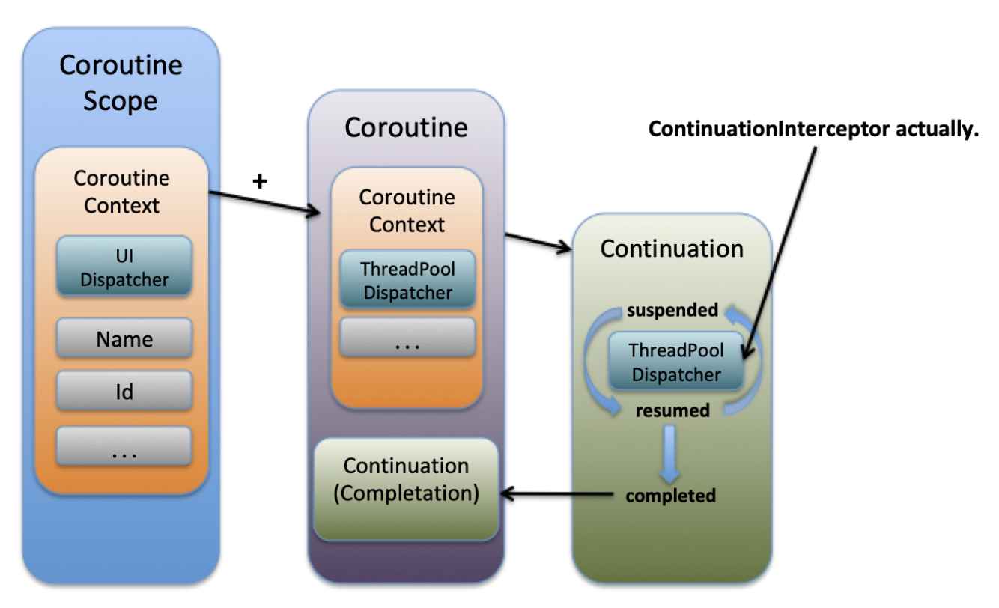

## 코루틴 개념 심화

----

코루틴을 구성하는 각 개념들에 대한 심도있는 내용을 다루어본다.

아래 과정을 통해 코루틴에 대한 기초를 학습한 것으로 가정한다. 
 * https://github.com/CodingBakery/KotlinStudy/blob/main/content/%EC%BD%94%EB%A3%A8%ED%8B%B4_%EA%B8%B0%EC%B4%88.md

### 코루틴 구성 요소

코틀린에서 코루틴은 크게 아래 2개의 요소로 구성되어있다.
 * CoroutineScope
 * CoroutineContext

그리고 생성된 코루틴은 다음의 요소들을 통해 핸들링된다.
 * Dispatcher
 * CoroutineScheduler

코루틴을 통해 로직이 실행되는 절차를 문장으로 풀어 표현해보자면 다음과 같다.
 * <span style="color:blue">CoroutineScope</span>에 정의된 코루틴 builder 함수(확장함수)를 이용하여 
 * 소속된 <span style="color:blue">CoroutineScope</span>에 정의된 <span style="color:blue">CoroutineContext</span>를 기반으로 필요한 코루틴을 생성한다.
 * 생성된 <span style="color:blue">Coroutine</span>은 <span style="color:blue">Dispatcher</span>에 의해 실행 block을 Task 단위로 묶어서 <span style="color:blue">CoroutineScheduler</span>로 dispatch 하면
 * <span style="color:blue">CoroutineScheduler</span>의 <span style="color:blue">Worker</span>가 할당되어 해당 Task를 실행한다.

### 코루틴의 실행

CoroutineScope에서 코루틴이 실행되는 과정을 그림으로 살펴보면 다음과 같다.


 * 코루틴을 실행하기 위해서는 반드시 CoroutineScope에 속해있어야함
 * CoroutineScope는 그에 속하는 CoroutineContext 정보를 가짐
 * CoroutineContext는 그에 속하는 Dispatcher와 코루틴의 ID, Name, ExceptionHandler 정보를 가짐
    * 아래에서 덧셈으로 표시된 이유는 CoroutineContext가 plus 연산자를 구현했기때문에 가능함
    * 
 * CoroutineScope 안에서 생성되는 코루틴은 자신에게 정의된 정보를 제외한 나머지는 부모(스코프)로부터 상속받아서 사용함
 * 첫번째 그림에서 Continuation이라고 되어있는 부분이 우리가 작성한 실제 수행로직 코드 블록임
```kotlin
val job = GlobalScope.launch {
   delay(1000L)
   print("World!")
}

public fun CoroutineScope.launch(
   context: CoroutineContext = EmptyCoroutineContext,
   start: CoroutineStart = CoroutineStart.DEFAULT,
   block: suspend CoroutineScope.() -> Unit
): Job {
    // ...
}

@InternalCoroutinesApi
public operator fun <T> invoke(block: suspend () -> T, completion: Continuation<T>): Unit =
   when (this) {
      DEFAULT -> block.startCoroutineCancellable(completion)
      ATOMIC -> block.startCoroutine(completion)
      UNDISPATCHED -> block.startCoroutineUndispatched(completion)
      LAZY -> Unit // will start lazily
}


/**
 * Interface representing a continuation after a suspension point that returns a value of type `T`.
 */
@SinceKotlin("1.3")
public interface Continuation<in T> {
   /**
    * The context of the coroutine that corresponds to this continuation.
    */
   public val context: CoroutineContext

   /**
    * Resumes the execution of the corresponding coroutine passing a successful or failed [result] as the
    * return value of the last suspension point.
    */
   public fun resumeWith(result: Result<T>)
}
```

위와 같이 생성된 Continuation 으로 생성된 실행 블록들은 Task 라는 개념으로 Wrapping 되어 아래의 그림과 같이 CoroutineScheduler로 전달되며, ForkJoinPool과 같은 형태의 구성을 통해 Worker들이 Task들을 처리하는 구조로 되어있다. 
 * 단, Continuation은 중단 및 재개를 위한 상태를 가지며, 각각 suspend 와 resume 이라고 칭한다.
 * 처음 Continuation으로 변경된 코드 블록은 최초에 suspend 상태로 생성됨
 * resume() 요청이 들어오게 되면 resumed 상태로 전환되어 실행됨
 * 재개(resume)가 요청될 때마다 현재 컨텍스트의 dispatcher 에게 dispatch(스레드 전환) 가 필요한지 isDispatchNeeded() 함수를 이용해 확인 한 후 
 * dispatch가 필요하면 dispatch()함수를 호출하여 적합한 스레드로 전달하여 수행됨


### 중단(suspend) 함수의 원리 

이쯤에서 다시 suspend 함수가 어떻게 동작하는지 알아보도록 하자.
suspend 키워드가 붙은 함수들은 코틀린 컴파일러에 의해 Continutation 파라미터가 함수의 마지막 파라미터로 추가되며 반환 값이 Any? 로 변경된다.
이렇기 때문에 suspend 함수는 코루틴이나 다른 중단 함수 안에서만 호출될 수 있다는 제약이 생기긴 하지만
코루틴이 제공하는 유용한 다른 중단함수들을 사용할 수 있게 된다는 장점을 갖게 된다.

아래의 suspend 함수는 바이트 코드로 다음과 같이 컴파일된다.
 * Lkotlin/coroutines/Continuation; 이라는 파라미터가 마지막에 추가된 것을 볼수 있으며
 * 리턴 타입 역시 Ljava.lang.Object 로 바뀌었다.
```kotlin
suspend fun sum(val1: Int, val2: Int): Int {
    delay(2000)
    return val1 + val2
}

com/smp/coroutinesample/basic/BasicSample4Kt.sum (IILkotlin/coroutines/Continuation;)Ljava/lang/Object;

```

이렇게 생성된 Continuation 을 이용하여 suspend / resume 전환 동작을 수행하며 수행 block을 일시 중단하고 재개할 수 있게 된다.

예제 코드를 통해 살펴보자.

```kotlin

fun runWithOneThread() {
   runBlocking {
      val elapsedTime = measureTimeMillis {
         val jobs = ArrayList<Job>()
         (1..10).forEach { num ->
            jobs += launch {
               longRunningTask(num, num + 1)
            }
         }
         jobs.forEach {
            it.join()
         }
      }

      print("소요 시간: ${elapsedTime}")
   }
}

suspend fun longRunningTask(input1: Int, input2: Int): Int {
    log("시작 : input1 : $input1, input2 : $input2")
    delay(1000)
    val intermediateResult = input1 + input2
    log("중간 계산 : $intermediateResult")
    delay(1000)
    val finalResult = intermediateResult * 2
    log("최종 계산 후 종료 : $finalResult")
    return finalResult
}
```

참고한 블로그에서 Coroutine의 호출 스택에 대해 설명한 내용을 추가로 첨부한다.
> 함수안에서 또다른 함수를 호출하면 스택에 이전 함수포인터를 저장함으로써 현재 함수 수행 후 결과를 돌려줄 위치를 기록해 놓습니다. 
이런식으로 A func -> B func -> C func 로 호출 하면 그 정보가 스택에 쌓이고, 
다시 C func -> B func -> A func 로 돌아오면서 스택의 정보가 해제 됩니다 (Stack unwinding).
(실제로 Continuation 의 구현체들은 CoroutineStackFrame 이라는 인터페이스 또한 구현하는데 여기에는 호출자 정보(caller stackframe) 또한 가지고 있습니다.)

> 일반적인 함수의 호출은 운영체제에서 그 호출 스택 관리를 해줍니다. 
그럼 중첩된 코루틴이나 중첩된 중단함수의 스택관리는 누가 해주는 걸까요? 
지금까지 이야기 한 것과 같이 코루틴 프레임워크가 CPS 방식으로 호출 정보(Continuation)를 스택 형태로 유지하고 있다가 호출 스택의 가장 마지막 함수가 실행을 종료하면 결과 값이 직전 호출 함수들로 전파되며 직전 함수를 재개(resume)해 나갑니다. 
만약 스택상의 어떤 함수가 예외를 발생시키면 예외 정보를 최초 호출함수까지 Continuation 을 통해 전달합니다.


## 몇가지 더 짚어보기
### Scope는 뭘 쓰는가

Coroutine의 Scope는, 해당 코루틴이 수행되는 비즈니스의 생명 주기 내에서 생성 및 소멸되도록 작성한다.

그런 의미에서 GlobalScope란 어플리케이션이 실행되는 내내 유지되는 Scope이기에 사용은 지양하는 것이 좋고, 

사용하게 되더라도 코드 내에 GlobalScope를 하드코딩하는 것은 바람직하지 않다.

1. 가급적 별도 스코프에서 동작하도록 코딩하기
```kotlin
CoroutineScope(Dispatchers.Default).launch {
   // 명시적으로 CoroutineScope 생성하기
}
```   
2. 다음과 같이 파라미터를 통해 외부로부터 Scope를 받아서 처리하게 하기
```kotlin
class ArticlesRepository(
    private val articlesDataSource: ArticlesDataSource,
    private val externalScope: CoroutineScope = GlobalScope,
    private val defaultDispatcher: CoroutineDispatcher = Dispatchers.Default
) {
    //...
}
```

### 코루틴을 취소 가능하게 작성하기

코루틴은 수행 중 취소가 가능하다. Job이 취소될 때 코루틴은 정지되거나 취소를 확인할 때까지 취소되지 않기 때문에 
다음과 같이 반복문으로 I/O와 같은 비용이 큰 작업을 수행하는 경우, ensureActive() 함수를 호출하여 
코루틴이 취소가 가능한지 확인하도록 하면 Job이 취소됐을 때 해당 부분에서 중단이 가능하다. 

```kotlin
someScope.launch {
    for(file in files) {
        ensureActive() // Check for cancellation
        readFile(file)
    }
}
```


## 실전 코드 예시

아래와 같이 CompletableFuture를 이용하여 멀티 쓰레드 기반의 비동기 호출을 수행한 후 
모든 요청이 종료되기를 기다리는 Java 코드를 코틀린으로 변경해보자.

### Java
```java
@Override
public void syncPlanDealList(PlanSync planSync) {
    CompletableFuture[] futures = Streams.ofNullable(planSync.getPlans())
            .map(Plan::getPlanId)
            .map(planningId -> CompletableFuture.runAsync(() -> syncPlanDealListPort.postSyncPlanDealListRequest(planningId)))
            .collect(Collectors.toList())
            .toArray(new CompletableFuture[]{});

    try {
        CompletableFuture.allOf(futures).get();
    } catch (Exception e) {
        throw new RuntimeException(e);
    }
}
```

### Kotlin (with Coroutine)
```kotlin

fun syncPlanDealList(planSync:PlanSync): Job {
    return CoroutineScope(Dispatchers.Default).launch {
       planSync.plans.map { plan -> plan.planId }
          .map {
             async {
                postSyncPlanDealListRequest(it)
             }
          }
          .forEach { println(it.await()) }
    }
}

suspend fun postSyncPlanDealListRequest(planId: String): String {
    delay(1000)
    return "[${Thread.currentThread().name}] ${planId} 동기화 완료"
}
```

## 생각해볼 것 
### Spring @Transactional 과 함께 활용할 수 없다?

코루틴에서 호출되는 로직들은, suspend 함수를 기준으로 각 실행 블록이 Task로 쪼개져 별도의 Thread 에서 동작하기 때문에
Transactional 과 같은 개념과 공존할 수 없다. 메서드를 시작한 쓰레드와, 중단 된 이후 종료되기까지 수행하는 쓰레드가 서로 다르기 때문에,
기대한 대로 관련된 모든 동작이 롤백되거나 할 수 없다.

아래와 같은 해결책 예시도 있으나, 꽤 번거로운 것 같다.
 * https://codeinlife.tistory.com/73

### suspend 함수의 한계

코루틴 내에서 실제 효과를 보려면 호출 대상 함수가 suspend 함수여야 할 듯 하다.
suspend 함수는 앞서 설명한 대로 코루틴 내에서만 실행이 가능하기 때문에 일반 블록에선 호출이 불가하다.
일반 함수를 래핑한 suspend 함수를 만들어 볼 수는 있겠지만 글쎄... 


## 관심있다면 공부해볼만한 것
CPS(Continuation Passing Style)


## 참고 자료
 * https://myungpyo.medium.com/reading-coroutine-official-guide-thoroughly-part-1-7ebb70a51910
 * https://myungpyo.medium.com/%EC%BD%94%EB%A3%A8%ED%8B%B4-%EA%B3%B5%EC%8B%9D-%EA%B0%80%EC%9D%B4%EB%93%9C-%EC%9E%90%EC%84%B8%ED%9E%88-%EC%9D%BD%EA%B8%B0-part-1-dive-2-25b21741763a
 * https://myungpyo.medium.com/%EC%BD%94%EB%A3%A8%ED%8B%B4-%EA%B3%B5%EC%8B%9D-%EA%B0%80%EC%9D%B4%EB%93%9C-%EC%9E%90%EC%84%B8%ED%9E%88-%EC%9D%BD%EA%B8%B0-part-1-dive-3-b174c735d4fa
 * https://myungpyo.medium.com/%EC%BD%94%EB%A3%A8%ED%8B%B4-%EB%94%94%EC%8A%A4%ED%8C%A8%EC%B3%90-%EC%A1%B0%EA%B8%88-%EB%8D%94-%EC%82%B4%ED%8E%B4%EB%B3%B4%EA%B8%B0-92db58efca24
 * https://stackoverflow.com/questions/64136645/is-it-possible-to-use-transactional-and-kotlin-coroutines-in-spring-boot
 * https://developer.android.com/kotlin/coroutines/coroutines-best-practices?hl=ko