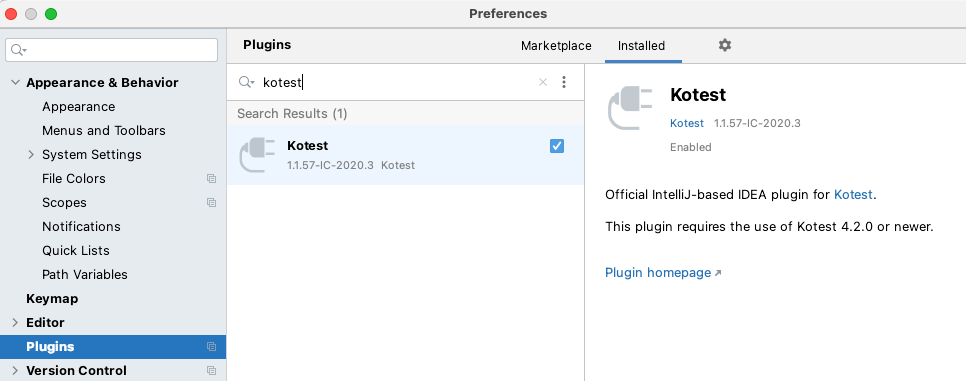
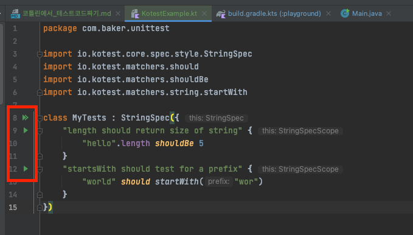

## kotest + mockk 로 테스트 작성하기

이렇게 생각하면 편할 것 같다.
 * kotest == junit
 * mockk == Mockito 

### Kotest

kotest는 코틀린을 위한 테스팅 도구이다.
 * https://kotest.io/docs/quickstart

kotest는 3가지 도구로 구성되어 있으며, 각 도구는 독립적으로 사용할 수 있다.
 * Test Framework
 * Assertion Library
 * Property Testing
   * 테스트용 input 을 자동으로 생성해주는 도구 제공
    
#### Test Framework 추가하기 (gradle)

```groovy
test {
   useJUnitPlatform()
}
```

```groovy
testImplementation 'io.kotest:kotest-runner-junit5:$version'
```

#### Assertion 라이브러리 추가하기 (gradle)

```groovy
testImplementation 'io.kotest:kotest-assertions-core:$version'
```

#### Property Testing 프레임워크 추가하기 (gradle)

```groovy
testImplementation 'io.kotest:kotest-property:$version'
```

### Testing Styles

코테스트는 10가지의 테스팅 스타일을 제공한다.
 * https://kotest.io/docs/framework/testing-styles.html
 * 기능적인 차이는 전혀 없으며, 단순히 테스트 코드를 구성하는 취향에 따라 사용하는 것

|Test Style|영감을 받은 부분|
|-----|-----|
|Fun Spec|ScalaTest|
|Describe Spec|Javascript frameworks and RSpec|
|Should Spec|A Kotest original|
|String Spec|A Kotest original|
|Behavior Spec|BDD frameworks|
|Free Spec|ScalaTest|
|Word Spec|ScalaTest|
|Feature Spec|Cucumber|
|Expect Spec|A Kotest original|
|Annotation Spec|JUnit|


### Mocking

코틀린을 위한 Mocking 라이브러리. Java에서 사용하는 Mockito와 같은 역할로 보면 된다. 
 * https://mockk.io/

#### Mockk 추가하기 (gradle)
```groovy
testImplementation "io.mockk:mockk:{version}"
```

#### 예제

```kotlin
// given
val car = mockk<Car>()

every { car.drive(Direction.NORTH) } returns Outcome.OK

// when
car.drive(Direction.NORTH)

// then
verify { car.drive(Direction.NORTH) }
```

### kotest plugin

IntelliJ 플러그인으로 kotest 라는 플러그인이 있음
 * kotest 4.2.0 이상의 버전 필요

설치하면 IDE에서 테스트 별로 실행하는 실행 버튼 등이 생김 





