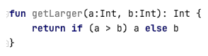
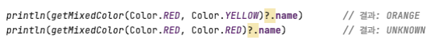

### 개요 
- 코틀린도 자바와 동일하게 서버/앱 개발에 대표적으로 사용되며, JVM에서 동작한다는 점은 동일하다. 
- 코틀린은 Java 와의 상호 운영성을 중시하므로 거의 100% 상호 호환이 가능하다.  
- 상호 호환을 통해 자바를 완전히 대체할 수 있는 언어가 되는 것이 주목적? 
- Java 보다는 JS의 문법과 많이 유사하다는 것을 느낄 수 있다. 

### 전체적으로 받은 느낌 
- Java 를 이용하여 개발하면서 겪은 불편한 점들을 개선  
- 코드량을 감소 
- Java에서 이루지 못한 것들을 반영? 
  - Class 를 정의하지 않고 함수 선언 가능  
  - 기본적으로 클래스는 상속되지 않게 하기 등  

### 그럼 어떤 것들이 다를까? 

#### 타입 선언 위치 & 불변 변수 선언 

Java는 타입 변수명 순서로 적지만, 코틀린은 변수명: 타입 으로 적는다. 
Java의 변수는 기본적으로 가변이나, final 을 이용해 불변 변수를 나타내지만 
코틀린은 var 키워드 이용하여 가변, val 키워드로 불변 변수를 나타낸다. 

#### Javascript 로도 컴파일이 된다? 

코틀린은 자바스크립트로도 컴파일이 가능하여, 코틀린 코드를 브라우저나 노드에서 실행할 수 있다. 
- Kotlin JS 헬로 월드: https://shs400.github.io/2020/01/02/kotlin01/ 

#### 타입 추론 

코틀린 역시 Java와 마찬가지로 컴파일 타임에 타입이 결정되는 정적 타입 지정 언어이나, 
코틀린은 문맥으로부터 유추 가능한 경우에 타입추론을 할 수 있으므로 코드에서 타입을 생략할 수 있다. 
- Java 10 에서 나온 로컬 변수 타입 추론과 유사 
- https://openjdk.org/jeps/286 
- Java 10 에서는 아래와 같이 로컬 변수를 정의할 수 있음 
  - var str = "Hello, World"; 

정적 타입이 갖는 아래와 같은 장점을 기반으로, 코드를 간결하게 짤 수 있도록 만들어진 언어이다. 
- 성능: 실행 시점에 어떤 메소드를 호출할 지 알아내는 과정이 필요 없으므로 메소드 호출이 빠르다. 
- 신뢰성: 컴파일러가 프로그램의 정확성을 검증하기 대문에, 런타임 오류 발생 가능성이 적어진다. 
- 유지 보수성: 객체가 어떤 타입에 속하는지 알 수 있으므로 처음 보는 코드를 다룰 때 용이하다. 
- 도구 지원: 안전하고 정확하게 리팩토링 및 코드 완성 기능 등의 도구 지원이 용이하다. 

#### Nullability 

코틀린은 nullable / not-null type 을 별도로 지원한다. (nullability) 
- NPE 오류를 피할 수 있게 돕기 위한 코틀린의 타입 시스템 
- 모든 멤버는 기본적으로 not-null 이다. 
  - var str: String 
  - 이 변수에 null 을 할당하는 경우 컴파일 에러가 발생하며, null 인 경우를 방어할 수 있는 코드를 작성하도록 컴파일러가 가이드한다. 
- Nullable 한 변수는 다음과 같이 타입 뒤에 ? 를 붙여 정의한다. 
  - var str: String? 

#### 묵시적 getter / setter 

getter / setter 를 코드로 직접 작성하지 않아도 묵시적으로 제공한다.  
단순히 필드를 호출하고 변수를 할당하듯이 사용하면 된다. 
- val 로 정의된 멤버는 getter 기능만 제공 
- var 로 선언된 멤버는 getter, setter 기능 제공 

custom getter / setter 를 별도로 정의할 수도 있다.  

#### Java는 구문, Kotlin은 식(Expression) 

자바에서는 모든 제어 구조가 (값을 만들어내지 못하는) 문인 반면에  
코틀린에서는 루프를 제외한 대부분의 구조가 (결과를 만들어내는) 식(expression) 이다. 

반대로, 대입문의 경우 자바에서는 식이었으나 코틀린에서는 문 이 되었다. 

#### 문자열 출력을 더 편하게 

문자열 템플릿 기능을 기본으로 제공한다. $변수명 또는 ${변수명} 을 이용하여 문자열 (“ “) 내부에 작성하면 된다.  

#### Smart Cast - 형변환도 더 편하게 

코틀린은 스마트 캐스트를 이용해서, 타입 체크를 한 이후에 강제로 캐스팅을 명시하지 않아도 된다. 
강제로 캐스트 코드를 작성하는 불편함이나, 실수로 적지 않는 경우 등을 방지할 수 있다 

#### 코틀린의 반복문 

코틀린에는 for (int i = 0; i < size; i++) 과 같은 구문이 없다. 
대신에 아래와 같은 iteration 의 편의를 위한 기능들을 제공한다. 

 
맵에 대한 반복문도 아래와 같이 좀 더 편하게 제공된다. 

 

#### 코틀린의 예외 처리 

코틀린은 checked Exception 이 존재하지 않는다. 개발자의 몫? 
단, try, catch, finally 는 자바와 동일하게 사용가능. try catch 문 역시 '식' 이다. 

 

#### 동등성 비교 방법 

동등성 비교시,  
자바에서 == 는 primitive 타입의 값에 대한 동등성이나, 객체의 참조 주소 값을 비교할 때 쓴다.  
그래서 실제 객체가 동등한지 판단하기 위해 자바는 equals() 함수를 사용한다. 
하지만 코틀린에서는 == 를 사용하면 내부적으로 equals를 호출해서 객체를 비교한다. ('객체' 동등성 비교) 
오히려 참조 비교를 위해서는 === 연산자를 이용한다. ('값' 동등성 비교) 

== 문구를 사용하면 내부적으로 요소가 null 인 경우 분기처리 하는 것으로 보인다. 
- https://kotlinlang.org/docs/equality.html 
- Java에서 처럼 “널이아닌값".equals(null) 과 같이 작성하도록 강제할 필요가 없다 

#### 함수의 디폴트 파라미터 & 파라미터 명 지정 

함수를 정의할 때 디폴트 파라미터 값을 정의할 수 있으며, 
함수 호출 시 파라미터 명을 지정해서 넘겨줄 수 있다. 
이를 통해 다음과 같이 활용해볼 수 있다.  

 
자바에서는 디폴트 파라미터라는 개념이 존재하지 않으므로 자바에서 코틀린의 위 함수를 호출할 수 있도록 하기 위해서는 다음과같은 어노테이션을 사용한다. 
- @JvmOverloads  
- 자동으로 디폴트 값과 함께 오버로딩 된 메서드를 생성해줌 

 

#### 확장 함수 

Javascript의 확장 메서드처럼 확장 함수를 정의하고 사용할 수 있다. (상세 내용은 별도 발표로 다룸) 
마찬가지 방법으로 확장 프로퍼티도 정의할 수 있다. 

 

#### 접근 제어자의 차이 

코틀린의 접근 제어자는 private, public의 경우 자바와 같지만  
코틀린의 protected는 하위 클래스에서만 접근이 가능하다. (같은 패키지여도 접근 불가)  
또한 package-private이 존재하지 않는다. (패키지는 단순 네임스페이스 용도로 사용하기 때문) 
대신, 같은 모듈 내에서만 공개하도록 하는 internal 이라는 접근 제어자가 존재한다.  
- 같은 모듈 = 한번에 컴파일 되는 프로젝트, 모듈 jar 파일 내부  
- Java에서는 internal에 딱 맞는 접근 제어자가 없으므로, 바이트코드상에서는 public 이 된다.  
- 그렇기 때문에 코틀린 코드에서는 접근이 불가하던 코드가 자바에서는 접근이 가능해지는 경우가 생긴다. 
- 또한 코틀린에서 protected로 정의한 클래스가 Java에서 동일한 패키지로 정의된 클래스에 접근이 가능해진다. 

이런 이유로 코틀린 컴파일러가, internal 멤버의 이름을 보기 나쁘게 바꾼다(mangle)  
- 기술적으로는 문제없이 사용할 수 있지만 멤버 이름이 보기 불편하고 못생겨보이게 바꿈으로써, 
- 우연히 메소드 이름이 겹쳐 오버라이드되는 경우를 방지하고, 실수로 internal 클래스를 모듈 외부에서 사용하는 일을 막기 위함이다. 

Mangle 한다는 표현이 임의의 못생긴 문자열을 붙이는 것인줄 알았는데... 뒤에 모듈(프로젝트) 이름 붙이고 끝나는건가?

 

#### By 키워드 

코틀린에서는 데코레이터 패턴을 사용할 때 유용한 by 기능을 제공한다. 
- 상속을 허용하지 않는 기존 클래스 대신 사용할 수 있는 새로운 클래스(데코레이터)를 만들면서, 기존 클래스와 같은 인터페이스를 데코레이터가 제공하게 만들고, 기존 클래스를 데코레이터 내부에 필드로 유지하는 방법이다. 

 

#### 그 외... 

코틀린은 함수(메서드)를 클래스 내부에 정의하지 않고 최상위 수준에 정의할 수 있으며, 변수로 지정하거나 메서드 인자로 사용하는 것도 가능하다. 

자바와 달리 배열 처리를 위한 문법은 따로 존재하지 않는다. (활용도가 낮다고 판단한듯) 

코드 마지막에 세미콜론을 붙일 필요 없다.  
- 단, enum class 의 필드 선언만은 예외이다. 

lombok의 @Data 와 같은 기능을 기본으로 제공한다.  
- getter, setter, toString, equals 등 데이터 객체로서의 역할만 수행 
- Java 14 부터 나온 record 클래스와 동일 
- 

sealed 클래스 - 상속을 특정 클래스들만으로 제한하는 방법을 제공한다. 
- Java 15 sealed 클래스와 동일 

Java 12의 개선된 switch 와 유사하게 동작하는 when 기능을 제공한다. 

코틀린은 객체 선언 기능을 통해 싱글턴 패턴을 언어에서 기본으로 지원한다.  
- 일반 클래스와 달리 객체 선언문이 있는 위치에서 생성자 호출 없이 즉시 인스턴스화 되므로, 생성자 선언은 쓸 수 없다. (필요도 없다) 
- 별도의 필드를 사용할수 있으나, 반드시 선언과 동시에 초기화하거나 custom getter를 정의해야한다. 

 

자바와 달리 코틀린의 선언은 기본적으로 public, final 이다. 
- 공개된 클래스이며, 상속이 불가함 
  - (이펙티브 자바) 특별히 하위 클래스에서 오버라이드 하도록 의도된 클래스와 메소드가 아니라면 모두 final로 만들어라  
- 단, override 메소드는 기본적으로 public(open) 이다. 명시적으로 final 을 지정하면 하위 구현체로의 공개를 막을 수 있다.  

중첩 클래스는 기본적으로 내부 클래스가 아니다. 코틀린의 중첩 클래스는 외부 클래스에 대한 참조가 없다.  
- 코틀린의 중첩 클래스에 아무런 변경자가 붙지 않으면 자바 static 중첩 클래스와 같다.  
- 바깥 클래스의 참조를 포함하게 만들고 싶다면 inner 변경자를 붙여주면 된다. 
- 내부 클래스 B에서 바깥 클래서 A의 참조에 접근하려면 this@A 라고 써주면 된다.  

||Java|Kotlin|
|------|---|---|
|중첩 클래스(바깥 클래스의 참조 X) |static class A|class A|
|내부 클래스(바깥 클래스의 참조 O) |class A|inner class A|
    

자바에서는 클래스 상속의 경우 extends, 인터페이스 구현의 경우 implements 를 사용하지만,  
코틀린은 클래스 이름 뒤에 콜론(:) 를 붙이고 인터페이스, 클래스 상관없이 콤마로 구분하여 나열하면 된다. 
- 단 클래스를 1개만 상속할 수 있는 점은 동일하다 

코틀린에서는 실수로 상위 클래스의 메소드를 오버라이드하는 경우를 방지하기 위해, 오버라이드 하는 경우 반드시 'override' 키워드를 명시해야한다. 
