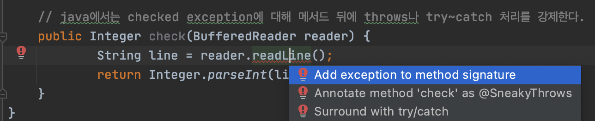
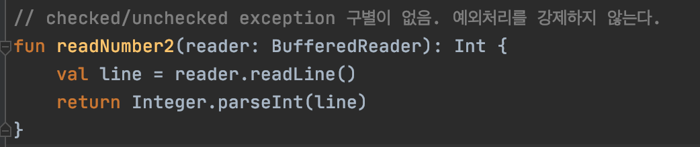
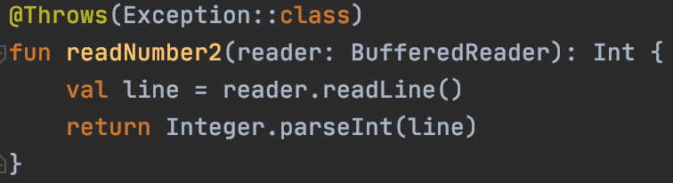
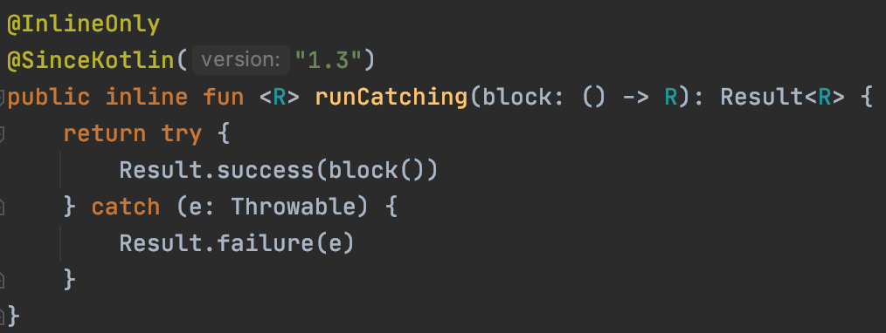
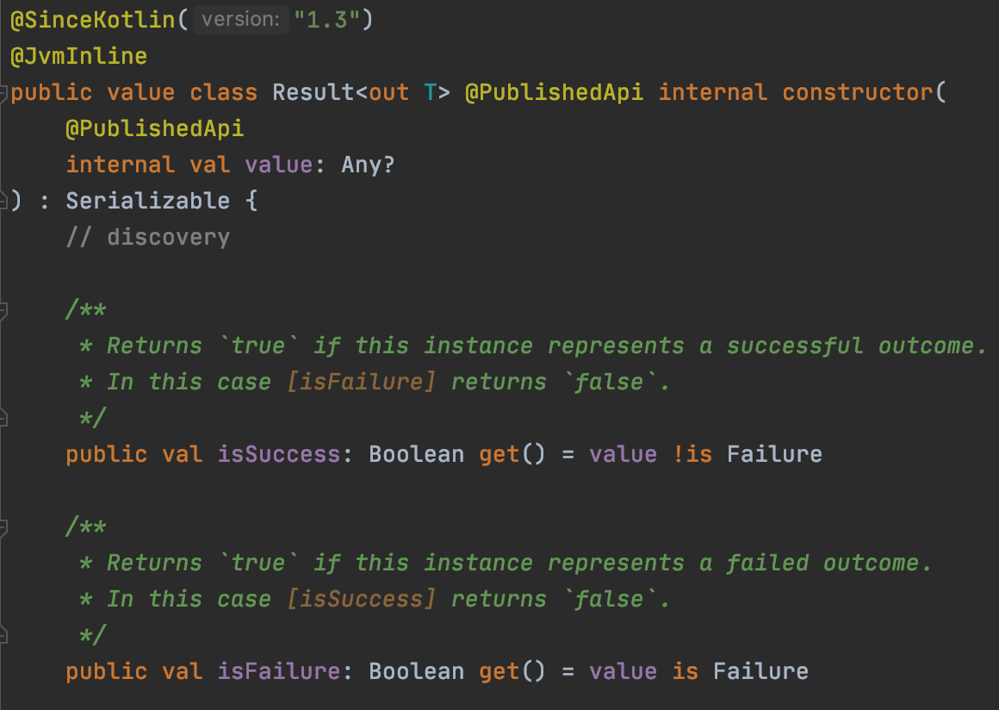

# 코틀린의 예외처리

코틀린에서 예외를 처리하는 방식은 Java와 비슷(거의 동일) 하다.

함수 실행 중 오류가 발생하면 예외를 던질(throw) 수 있고 함수를 호출하는 쪽에서는 그 예외를 잡아(catch) 처리할 수 있다. 예외에 대해 처리를 하지 않는 경우 함수 호출 스택을 거슬러 올라가면서 예외를 처리하는 부분이 나올 때까지 예외를 다시 던진다.(rethrow)

   

​         

### throw 로 예외 던지기

- `throw` 키워드로 예외를 던진다.
- `new`를 사용하지 않고 예외 인스턴스를 생성한다.
- 자바와 달리 `throw`는 `식`이므로 다른 식에 포함될 수 있다.

```kotlin
val percentage =
        if (number in 0..100) {
            number
        } else {
            throw IllegalArgumentException("A number value must be between 0 and 100: $number")
        }
```

```kotlin
// Elvis 표현식의 일부로 사용
fun checkNumber2(message: String?): Int {
    return message?.length ?: throw IllegalArgumentException("String is null")
}
```

* `throw` 표현식은 `Nothing` 타입의 값을 반환 한다. 
  *Nothing* 타입을 사용하여 항상 예외를 throw할 것임을 나타낼 수 있다.

  ```kotlin
  fun abstractException(message: String): Nothing {
      throw RuntimeException(message)
  }
  ```

  > Nothing 은 어떠한 값도 포함하지 않고, 인스턴스를 생성할 수 없는 타입.
  >
  > 함수의 리턴타입으로 Nothing을 사용하는 경우
  >
  > *  **함수가 리턴 될 일이 없을 경우** 
  > * **예외를 던지는(throw Exception) 함수**
  >   * 함수에서 예외를 던지는 것은 정상적으로 함수가 종료되는 것이 아니기 때문에 "함수가 리턴되었다"고 보지 않는다.   
  >
  >    ​       
  >
  >    함수의 리턴타입. - Nothing 과 Unit 의 차이
  >
  > * Unit : 함수의 리턴 대상이 없음
  >* Nothing : 리턴이라는 행위 자체를 하지 않음


​          

### try ~ catch (finally) 예외 처리하기

발생한 예외를 직접 잡아서 처리하고 싶을때, `try`, `catch`를 사용한다. 방법은 Java와 동일.

* 예외타입을 쓸때는 e 뒤에 콜론(:)을 적고, 그 뒤에 예외 타입을 정의합니다.

```kotlin
fun readNumber(reader: BufferedReader): Int? {
    try {
        val line = reader.readLine()
        return Integer.parseInt(line) // 숫자형식이 아닌 경우 에러 발생.
    } catch (e: NumberFormatException) {
        return null
    } finally {
        reader.close() // 무조건 실행되는 부분.
    }
}
```


​          

### try 식 사용하기

- `try` 키워드는 `if`나 `when`과 마찬가지로 **식**이다. 따라서 try의 값을 변수에 대입할 수 있다.
- 다만, 반드시 중괄호 {} 로 감싸주어야 한다.

```kotlin
fun readNumber3(reader: BufferedReader) {
    val number = try {
        Integer.parseInt(reader.readLine())
    } catch (e: NumberFormatException) {
        return // null로 바꾸면 null을 반환
    } finally {
        println("this is finally block") // 항상 실행됨
    }
    println(number)
}
```


​          

### 다중 catch 블록

자바와 같이 멀티 캐치블록을 생성할 수 있다. (작은 범위의 Exception부터 순서대로 캐치해야 한다.)

```kotlin
try {
    val result = 25 / 0
    result
} catch (exception: NumberFormatException) {
    // ...
} catch (exception: ArithmeticException) {
    // ...
} catch (exception: Exception) {
    // ...
}
```


​         

### 코틀린은 checked exception과 unchecked exception을 구별하지 않는다

* 코틀린은 Java에서 예외의 개념을 상속하지만 checked exception을 지원하지 않는다.

* 코틀린에서는 `throws`절이 없다.

  * 자바에서는 checked exception에 대해 catch로 잡아서 처리하거나, 함수 뒤에 throws 를 정의하여 메소드 밖으로 던지는 등  명시적으로 예외를 처리하는 것이 강제된다. (그렇지 않으면 Compile 에러 발생)

  

  * 하지만 코틀린은 checked exception 과 unchecked exception을 구별하지 않기 때문에 예외처리를 강제하지 않는다.

  

  * Java, 타 언어와의 호환성을 위해 `@Throws()` 어노테이션을 제공하여 checked exception을 전파할 수 있다.

  

​       

* **왜 checked exception 처리를 강제 하지 않을까..?**

  * 프로그래머들이 의미 없이 예외를 다시 던지거나, 예외를 잡되 처리하지 않고 그냥 무시하는 코드(e.getStackTrace()...) 를 작성하는 경우가 흔하기 때문이라고 한다.

  * 이 내용에 대해 언급한 블로그를 찾았다 https://taes-k.github.io/2021/12/29/kotlin-checkedException/

  * 위 블로그에서 정리한 코틀린 개발진에서 얘기하는 checkedException의 불필요성

    >* 많은 `CheckedException`은 무시처리 되고 있습니다.
    >* 소규모 프로그램에서는 개발자의 생산성과 코드품질을 향상시킬수 있으나, 일반적인 대규모 소프트웨어에서는 전혀 그렇지 않습니다.
    >* 낮은수준에서 발생하는 특정유형의 `CheckedException` 의 경우 (File I/O, Network, Database …) 일반적인 응용프로그램에서는 알 필요 없거나 알고싶지 않아합니다. 만약 Exception을 캐치한다고 하더라도 적절하게 대응하기 힘든경우가 대부분이라 `RuntimeException`으로 rethrow처리하는 경우가 많습니다.
    >* `CheckedException`사용시 코드의 확장성에 이슈가 생길수 있습니다. 단일 CheckedException 사용은 훌륭하게 동작하는것으로 보이나 4~5개의 서로다른 `CheckedExcpetion`을 사용하는 하위 API를 호출하는 경우 Exception 체인이 기하급수적으로 증가할 수 있습니다.
    >* …
    >
    >
    >
    >코틀린 개발진에서 공유하고자 하는 내용 아티클 원문
    >https://www.artima.com/articles/the-trouble-with-checked-exceptions

  * Baeldung 에 나와있는 내용
    https://www.baeldung.com/kotlin/exception-handling

    > 확인된 예외는 Java에서 논란의 여지가 있는 기능으로 간주됩니다. **코드 품질을 추가로 높이지 않고도 개발자 생산성을 저하시킵니다** . 다른 문제들 중에서도 확인된 예외는 상용구 코드, 람다 식 사용 시 어려움으로 이어집니다.
    >
    > 따라서 다른 많은 현대 프로그래밍 언어와 마찬가지로 Kotlin 개발자도 언어 기능으로 확인된 예외를 포함하지 않기로 결정했습니다.


​          

### use 함수로 자원 관리

코틀린에는 자바7의 try-with-resource와 같은 기능을 제공하는 "use"라는 함수가 코틀린 표준 라이브러리 안에 들어가 있다.

```java
//자바 try-with-resource
//AutoCloseable을 구현한 객체에 대해 자원을 사용후 자동으로 close 해준다.
public String readLineFromFile(String path) throws IOException {
   try (BufferedReader br = new BufferedReader(new FileReader(path))) {
       return br.readLine();
   }
}
```

use 함수는 자원에 대한 확장 함수이며, 람다를 호출한 다음에 자원을 닫아주는 식으로 동작한다.   
정상 종료된 경우는 물론이고, 람다 안에서 예외가 발생한 경우에도 자원을 확실히 닫아주기 때문에, 성능상 유리함을 얻을 수 있다

```kotlin
//코틀린 use함수로 자원 관리
fun readLineFromFile(path: String): String {
    BufferedReader(FileReader(path)).use { br ->
        return br.readLine()
    }
}
```


​     

### runCatching

`Result`클래스와 `runCatching` 이라는 inline function을 사용하여 예외처리를 할 수 있다.

`runCatching`은 kotlin 1.3부터 지원한다.

> 코루틴에서 에러처리를 할 때 구글이 권장하는 방식이다.
>
> Result는 동작이 성공하든 실패하든 동작의 결과를 캡슐화해서 나중에 처리될 수 있도록 하는 것이 목적이다.


​       

* runCatching 사용법

```kotlin
val colorName: Result<String> = runCatching {
    when (color) {
        Color.BLUE -> "파란색"
        Color.RED -> "빨간색"
        Color.YELLOW -> "노란색"
        Color.ARMARNTH -> throw Error("처음 들어보는 색")
    }
}.onSuccess { it:String ->
    //성공시만 실행
}.onFailure { it:Throwable ->
    //실패시만 실행 (try - catch문의 catch와 유사)
}.also {
  // finally
}
```

블록내에서 throw 하더라도 runCatching 함수는 해당 Exception을 밖으로 throw하지 않는다.   
블록을 실행한 결과인 반환값이나 Exception을 runCatching 함수가 반환한  Result 로부터 취득하는 것이 가능하다.


​        

`runCatching`은  인자로 받은 block() 함수를 실행하여 Result 오브젝트를 반환하고,   
 exception 발생 시 Result.failure() 을 실행한다.



​       

Result Class는 4개의 함수와 property를 제공한다.

- isSuccess : 성공 여부
- isFailure : 실패 여부
- getOrNull() : exception이 발생하지 않은 경우 해당 값, 발생한 경우는 null 리턴
- exceptionOrNull() exception이 발생한 경우 해당 exception, 발생하지 않은 경우는 null 리턴

 이외에도 Result에 대한 다양한 extension이 존재하는데 이것들을 잘 사용하면 좋다.    
Result<T> 반환 타입의 경우 chaning하여 사용 가능하다. extension별 필요한 동작 내용들은 다음 문서에서 확인해서 활용하면 된다. ([링크](https://kotlinlang.org/api/latest/jvm/stdlib/kotlin/-result/))




   

​          

​       


> [출처]
>
> https://www.baeldung.com/kotlin/exception-handling
>
> https://taehyungk.github.io/posts/android-kotlin-basic-5/
>
> https://taes-k.github.io/2021/12/29/kotlin-checkedException/
>
> https://0391kjy.tistory.com/11

